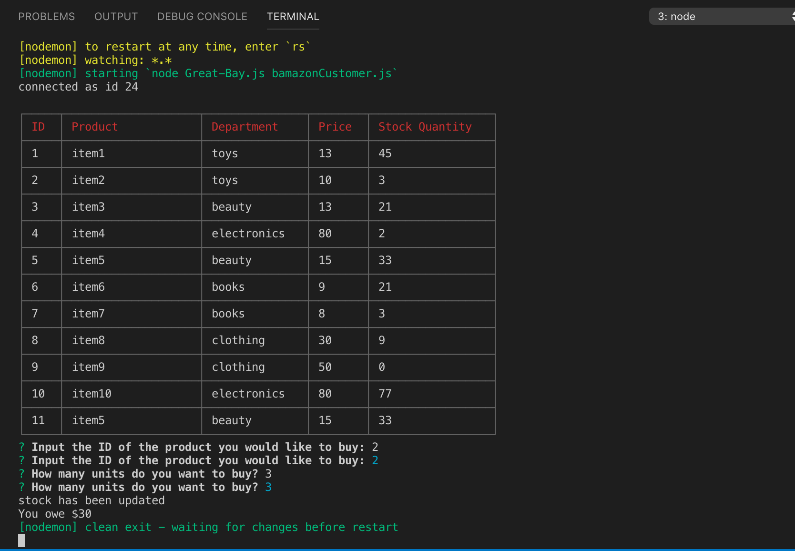
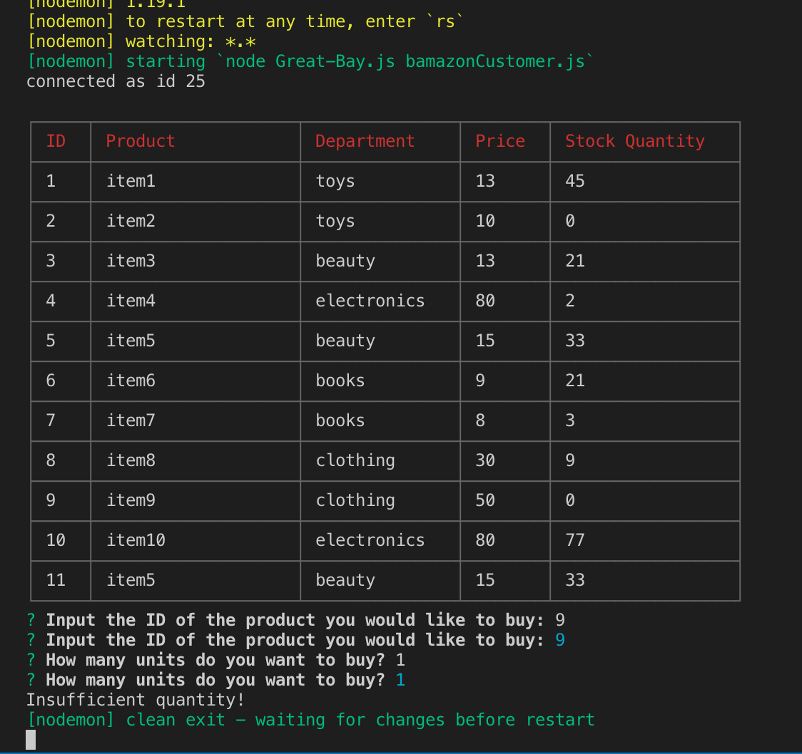

# bamazon

This bamazon app is able do the following:

Enter "node bamazonCustomer.js to enter the app.
- First you get to see what is in stock.
  1. Pick an item
  2. Tell us how many do you want
  3. If is available, will tell you the total cost, if not will notice you too.

## Usage

Visual Studio Code

## Resource & Helps

[Google](www.google.com)

[w3school](https://www.w3schools.com)

[stackoverflow](https://stackoverflow.com)

## Github link  

[GithubProfile](https://github.com/felix911104)

## Repo links

[bamazon](https://github.com/felix911104/bamazon)

## GoogleDrive Link to show the project 

- not available

## To use this app

In order to test this app,
you will need to have your own spotify key and install the npm packages list below.

1. [mysql]
2. [inquirer]
3. [cli-table]

## Screen shots

Here are some scrren shots of how the result will show.

## Author
Felix Zhang
